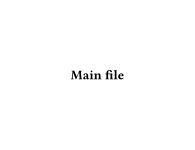
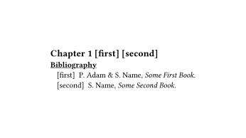
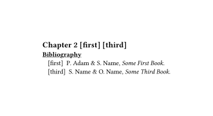
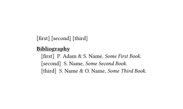

# Multiple Bibliography
This Typst package allow multiple bibliographie using the build-in typst syntax
fonction for citation an bibliography.

# Working example

Here is the code of a basic example, one bibliography file and two chapter that
are included in a main file. Yes we are calling multiple times in the same file
the `bibliography` function but it works because it has been complety overriden.

```yaml
# bib.yaml
first:
    type: book
    title: Some First Book
    author: Paul Adam, Surname Name
second:
    type: book
    title: Some Second Book
    author: Surname Name
third:
    type: book
    title: Some Third Book
    author: Surname Name, Other Name
```

```typ
// chap1.typ
#import "../multi-bib.typ" : multi-bib
#show: multi-bib
#counter("global_counter").step()
#counter("cite_counter").update(0)

#set page(width: auto, height: auto)
== Chapter 1 @first @second

#bibliography("../examples/bib.yaml")
```

```typ
// chap2.typ
#import "../multi-bib.typ" : multi-bib
#show: multi-bib
#counter("global_counter").step()
#counter("cite_counter").update(0)

#set page(width: auto, height: auto)
== Chapter 2 @first @third

#bibliography("../examples/bib.yaml")
```

```typ
// main.typ
#import "../multi-bib.typ" : multi-bib
#show: multi-bib

#set page(width: auto, height: auto)
== Main file

#include "chap1.typ"
#include "chap2.typ"

#counter("global_counter").step()
#counter("cite_counter").update(0)

@first @second @third

#bibliography("../examples/bib.yaml")
```

Here the two chapter (we can imagine that there are very long chapter and you
want multiple bibliography in multiple files).

Here is the result :






# Why this package ?
This package tries to resolve the missing feature of importing multiple
bibliogrphies in typst.

This has already been discussed in multiple issues and in the typst community :
- [Github feature request](https://github.com/typst/typst/issues/1097)
- [Typst forum multi file setup question](https://forum.typst.app/t/how-to-share-bibliography-in-a-multi-file-setup/1605)

# Benefits and Drawbacks
## Benefits
### Allow easy customization of citation and bibliography
- this allows complete customization (in typst and not a citation language) over
how citate are showed and customization of the bibliographie. This is the first
reason why I have written this. For writing (non verified) scientific paper, I
want to have custom citation and bibliography that are very clear (not the cutom
\[1\] \[2\] citation).

## Drawbacks
### Predefined bibliography style not supported
- this does not permit to use the citation style predefined that can be usually
  used in the bibliography file.

**Fix** : you can write (in typst) your own citation style. Just a bit of scripting and
  you have whatever you want.
### Path problem
- the path given to the bibliography function is not used. The file used is the
  one given by the first function TODO. Indeed the path given can be relative
  and is from the file that imports the template. So the template have a
  relative from this file but not from the template itself. The simplest way to

**Fix** : hardcoding the path that the template is looking is an easy way to fix this
issue.
### Only support yaml bibliography
- only the yaml file in parsed using the `yaml` function in typst.

**Fix** : this template parse him self the bibliographie file. If you add some code to
parse a `.bib` file this easily works with an other format than
## Title Specific Bibliography given a language
- as said none of the feature of the bibliography are preserved. If you set a
specific language, the title of the bibliographie will not change.
**Fix** : Hardcode the title in the code

# How it works
- The citation function is also overriden. I add a `label` and a `metadata` to
be able to reference the citation in the bibliography.
- The bibliographie function is completely override. It does nothing of what is
  has done previously, none of its parameter are taken into account either. It
mainly parses the yaml file, 


Here is an extract of the show rules to make this works. This is pretty short
and thus can be copied easily in your template to make it work as you want.


# Contributing
- Don't hesitate to contribute [here in github](https://github.com/pauladam94/multi-bib)
- If you don't understand what I have done don't hesitate to open issue even
just for asking a question on [github](https://github.com/pauladam94/multi-bib)
